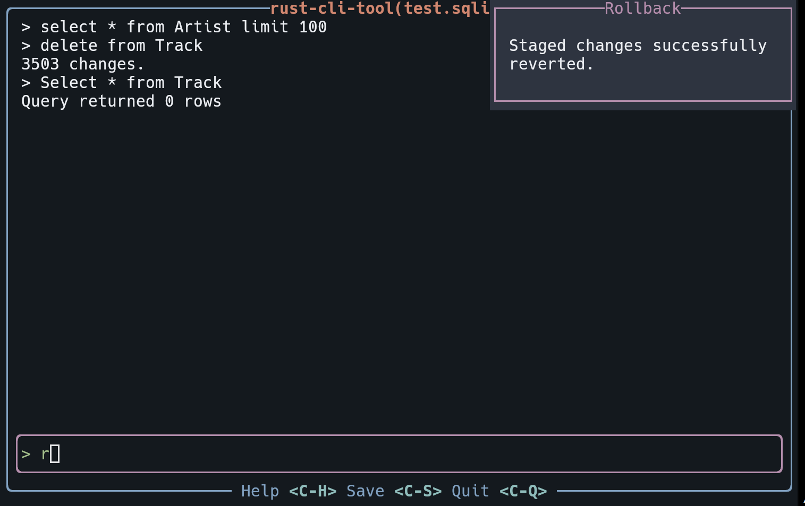
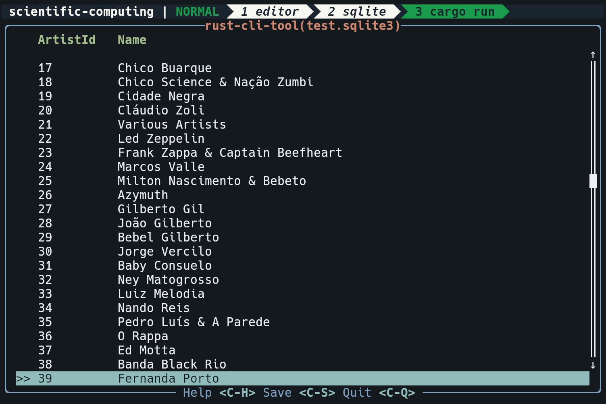

# rivet

A simple, terminal-based UI tool for interacting with SQLite databases, built with Rust. It provides a safe way to execute queries with a transaction-based workflow, preventing accidental changes.



## Features

*   **Interactive SQL Terminal:** Execute SQL queries in an interactive terminal.
*   **Safe by Default:** All non-`SELECT` queries are executed within a transaction. Changes are staged and must be explicitly committed to be saved.
*   **Commit & Rollback:** Easily commit your staged changes or roll them back with simple keyboard shortcuts.
*   **Read-Only Mode:** Open databases in a read-only mode to prevent any accidental writes.
*   **Tabular Data Viewer:** View `SELECT` query results in a scrollable table.
*   **Command History:** Navigate through your previous commands.
*   **Themable:** Colors can be customized.

## How It Works

The application is built using `ratatui`, a Rust library for building Terminal User Interfaces (TUIs). It is structured into two main components:

1.  **The UI (`src/ui`)**: Manages the display and user input. It has different screens for the terminal, results view, and help popups.
2.  **The SQL Session (`src/sql_session.rs`)**: Manages the connection to the SQLite database. This is where the core safety features are implemented.

### Safety First: Transactions

To prevent accidental modifications to your database, `rivet` uses a transaction-based workflow.

*   When you execute your first non-`SELECT` query (e.g., `INSERT`, `UPDATE`, `DELETE`, `CREATE`), a `BEGIN IMMEDIATE` transaction is automatically started.
*   All subsequent changes you make are part of this transaction and are held in a pending state. They are **not** yet written to the database file.
*   You can continue to execute queries and all changes will be accumulated in the current transaction.
*   To save your changes to the database, you must explicitly **commit** the transaction with `Ctrl-S`.
*   If you've made a mistake or want to discard your staged changes, you can **rollback** the transaction with `Ctrl-R`. This will undo all changes made since the transaction began.
*   Committing or rolling back will end the current transaction. The next non-`SELECT` query will start a new one.

This workflow ensures that you have a chance to review your changes before they become permanent.

## Project Status

This project is currently in an **alpha state**. This means it is under active development, may contain bugs, and its features and APIs are subject to change without notice. It is not yet recommended for production environments. Your feedback and contributions are welcome!

## Getting Started

### Prerequisites

*   [Rust](https://www.rust-lang.org/tools/install)

### Building and Running

1.  Clone the repository:
    ```sh
    git clone https://github.com/your-username/rivet.git
    cd rivet
    ```
2.  Build the project:
    ```sh
    cargo build --release
    ```
3.  Run the application:
    You must provide a path to a SQLite database file.
    ```sh
    ./target/release/rivet my_database.sqlite3
    ```

## Usage

### Command-line Arguments

`./target/release/rivet [OPTIONS] <FILE>`

**Arguments:**

*   `<FILE>`: Path to the SQLite database file. If the file does not exist, it will be created.

**Options:**

*   `-r`, `--read-only`: Open the database in read-only mode.

### Keybindings

| Keybinding | Action                               |
| :--------- | :----------------------------------- |
| `Ctrl-S`   | **Commit** the current transaction.  |
| `Ctrl-R`   | **Rollback** the current transaction.|
| `Ctrl-Q`/`Ctrl-C`   | **Quit** the application.            |
| `Ctrl-H`   | Show the **Help** window.            |

### Results View

When a `SELECT` query is executed, the results are displayed in a table.



Use the following keys to navigate the results:

| Key(s)      | Action              |
| :---------- | :------------------ |
| `j` or `Down` | Move to the next row. |
| `k` or `Up`   | Move to the previous row. |
| `h` or `Left` | Move to the previous column. |
| `l` or `Right`| Move to the next column. |
| `q` or `Esc`  | Return to the terminal. |

## Upcoming Features

*   **Customizable Themes:** More options for changing the application's color scheme.
*   **Expanded Help Tooltips:** More comprehensive in-app help and guidance.
*   **Enhanced Query Editor:** Improvements to the SQL input experience.
*   **Export/Import Data:** Functionality to export query results or import data.
*   **And More!**

## License

This project is licensed under the Apache 2.0 License - see the [LICENSE](LICENSE) file for details.
